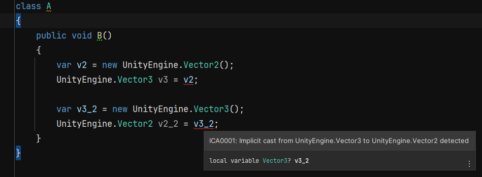

# Unity.ImplicitCastAnalyzer

This analyzer detects an implicit cast from Vector2 to Vector3 or vice versa.



## Install
Add git url
```
https://github.com/Egliss/Unity.ImplicitCastAnalyzer.git?path=Unity.ImplicitCastAnalyzer.Package/Assets/
```